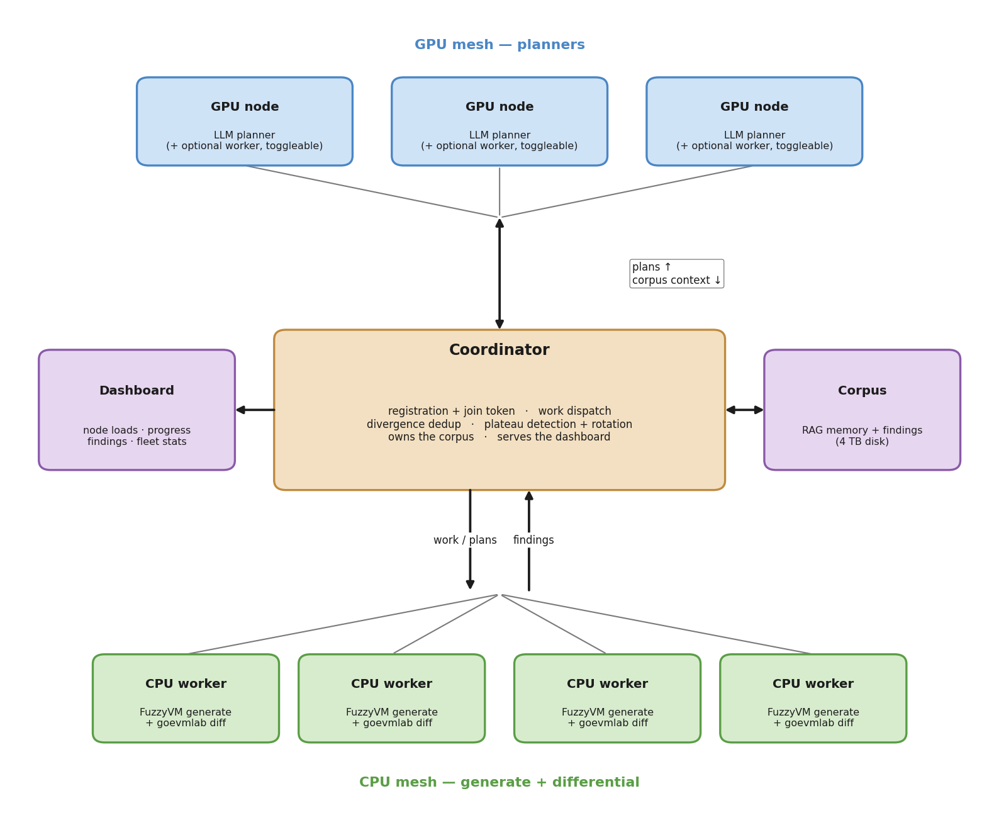

# Distributed Fuzzing Design

Status: design, not built yet. This is the plan for running the LLM-guided fuzzer across more than one machine so we can throw whatever compute we can get at it, local boxes and cloud boxes mixed.

## The shape

Three tiers. GPU machines plan, the coordinator runs the show, CPU machines generate and diff.

The split follows the hardware. Plan generation is the only part that needs a GPU, and it is cheap and infrequent, a few seconds per batch. Everything heavy is CPU: FuzzyVM generating tests and goevmlab diffing them across clients. So the machines with big GPUs become planners, and everything else, plus the spare CPU on the GPU boxes, becomes the worker mesh that does the actual fuzzing and diffing. One coordinator sits in the middle and owns every fleet-wide decision. No distributed store, no peer gossip, one brain.

This does not change the pipeline. The single-machine flow already runs plan, then generate, then diff in one process (`run_batch.py`). We are cutting that same flow along the GPU/CPU line, nothing more.



The diagram is generated by `docs/gen_architecture.py` (matplotlib, exact coordinates, so it never drifts). Regenerate it after the topology changes:

```bash
python3 docs/gen_architecture.py
```

## What the corpus is

The corpus is the planner's memory. It is what the model reads to write the next plan, and it is where run outputs go when they come back. Static knowledge seeds it: EIPs, the opcode reference, past client-divergence incidents, the same material the single-machine RAG index already holds. Then the fleet grows it. Every batch a worker finishes produces findings, and those findings flow back into the corpus, so the next plan is conditioned on what the whole fleet has seen, not just one machine's last few runs.

That is the entire reason to centralize it. On one machine the feedback loop only knows what that machine just did. Pool the corpus across the fleet and a divergence found on any worker informs every planner's next plan. The corpus is the shared asset. The models are replicated, one per GPU, however many GPUs we have. The corpus is the one thing there is exactly one of.

It lives on a 4 TB disk drive hung off the coordinator. That drive is slow at tiny random reads but fine for the sequential, batched access this workload does, and at the node counts we are planning for it will not be the bottleneck. Planners read it live through the coordinator at plan time, so a new finding is visible to the next plan without any sync step.

## Components

### Coordinator

One process, the only thing that makes fleet-wide decisions. That is what keeps the fleet coherent. It handles:

- Registration and the join token. A node phones home when it boots, presents the token, and gets admitted with a role.
- Work dispatch. Planners ask for something to plan, workers ask for a plan to run. The coordinator hands it out.
- Divergence dedup. When a worker reports a flaw, the coordinator decides whether it is a new bug or another hit on one already seen.
- Plateau detection and rotation. This is the `rotate.py` logic, moved here and run against the global corpus instead of one node's local files.
- Owning the corpus. Reads and writes go through the coordinator.
- Serving the dashboard.

If the coordinator dies it restarts and reads its state back from disk. Workers and planners retry with backoff while it is down. We do not build coordinator failover; for a trusted fleet on a VPN that is not worth the complexity.

### GPU node (planner)

Runs the LLM and emits plans. It pulls corpus context from the coordinator live, generates a plan the same way `call_llm` does today, and hands it back. The models sit behind the coordinator as a pool: a worker never talks to a GPU box directly, it asks the coordinator for a plan and the coordinator routes the request to whichever planner is free. Add a second GPU, you get a second planner in the pool, no worker-side change.

### CPU node (worker)

Takes a plan, runs FuzzyVM to generate the tests, runs goevmlab to diff them across clients, pushes the findings back to the corpus. Generate and diff stay together here, same as the current single-machine batch. The worker holds nothing durable. If it dies mid-batch the coordinator reissues the work and the half-finished local output is discarded, because nothing is reported until the batch completes.

### Module decoupling

The planner and the worker are separate modules, not one program. A GPU box can run both at once, using its GPU to plan and its spare cores to fuzz. Or you flip the worker module off and the box is a pure planner, which is what you want when you need that machine's CPU back for something else. The decoupling is a hard requirement, not a convenience: the worker has to be a thing you can stop on a GPU host without touching the planner.

### Corpus store

The 4 TB drive, holding the planner memory described above plus the bulky artifacts worth keeping, the failing state-tests and per-VM traces behind each divergence. Most generated tests are never stored, only the ones tied to a finding. Live-queried by planners through the coordinator.

### Dashboard

A frontend on the coordinator. One thing to run, one place to look. It shows per-node load and fuzzing progress, a live feed of findings as they come in, and fleet-wide stats: tests generated, divergences found, divergences per CPU-hour. It reads the same state the coordinator already keeps, so it is a view, not a second source of truth.

## Plugging in a node

The headline requirement is that adding a machine takes near-zero ceremony. No editing config on the coordinator, no pre-registering the node. You run one script, give it the coordinator's VPN address and the join token, and it does the rest:

1. Detect whether it has a usable GPU.
2. Register with the coordinator over the VPN, presenting the token, declaring its capability.
3. Get assigned a role: planner if it has a GPU and the coordinator wants more planning capacity, worker otherwise. The coordinator decides, not the node.
4. Start pulling work.

Pull it out and the coordinator notices the missing heartbeat, frees whatever it was doing, and the fleet carries on. The whole point is that the fleet size is something you change by starting and stopping that one script, nothing else.

## Auth

A shared join token. A node presents it at registration; without it, the coordinator refuses. On a trusted VPN that is enough, and it is a clean seam to harden later if this ever needs to leave the VPN. We are not building per-node certificates now. The token check is the boundary; everything past registration assumes the node is trusted.

## Promotion: what goes into the corpus

Same rule the single-machine system uses, scaled to the fleet. Run output goes back into the corpus. Workers report their findings, the coordinator writes them in, and they become retrievable context for the next plan. We are not building a novelty score or a coverage gate to decide what earns a spot. Findings are small, so we keep them.

The one place that needs care is divergences, because that is where the fleet would otherwise lie to us. Ten workers fuzzing similar objectives will trip the same client bug over and over. If every one of those reports counts as a separate divergence, the headline number (divergences per CPU-hour) inflates and the corpus fills with duplicates of one bug. So divergences get deduplicated on the way in.

The dedup key cannot be the obvious one. The `Divergence` records `have` and `want`, which are post-execution state roots, and a state root encodes the whole final state, so two different tests that trip the same bug land on different roots. Keying on the roots treats one bug as many. The real signature is where the clients first disagree, not how they end up. On a flaw, the coordinator (or the worker, before reporting) walks the per-VM traces to the first diverging step and keys on the client pair, the opcode at that step, and which field diverged. Same bug from different tests lands on the same key and counts once, with a hit counter and one stored example. Traces are expensive, so this only runs on the handful of tests that actually flaw, after a fast first pass finds them.

## What changes from the current code

Not a rewrite. The existing modules already split along the right lines.

- `run_batch.py` is the body of a worker. The LLM call moves out to the planner; the FuzzyVM run and the diff stay. `canonical_plan_id` is unchanged; that hash stays the plan's identity.
- `differential.py` is the worker's diff step, with the `Divergence` records becoming the raw input to dedup. The trace-walking for the dedup key is new code next to it.
- `rotate.py` moves to the coordinator and reads the global corpus instead of a local directory. The `detect_plateau` and `propose_objective` functions are already pure enough to relocate.
- `gather_recent_findings` becomes a coordinator query instead of a filesystem scan.

The new pieces are the coordinator service, the node-join script, and the dashboard. Everything else is existing logic moved to the side of the GPU/CPU line where it belongs.

## Open questions

- How the coordinator balances planner capacity against worker demand when GPU boxes can be either. Probably keep enough planners to never starve the workers and let the rest fuzz, but the exact policy is unsettled.
- Whether workers need disjoint seed ranges so two of them don't explore the same space. Likely worth it, mechanism is small, but it is not load-bearing for a first cut.
- Dashboard build: whether it is a small served web page or something we already have lying around. Decide when we get there.
